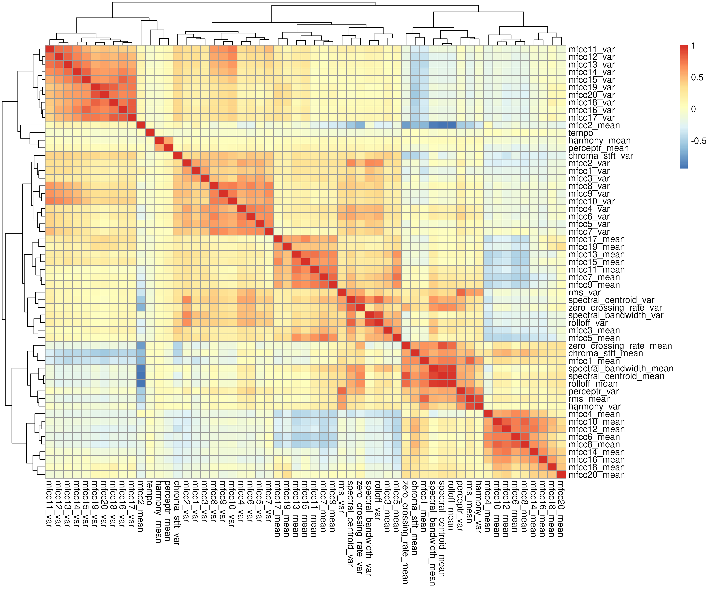
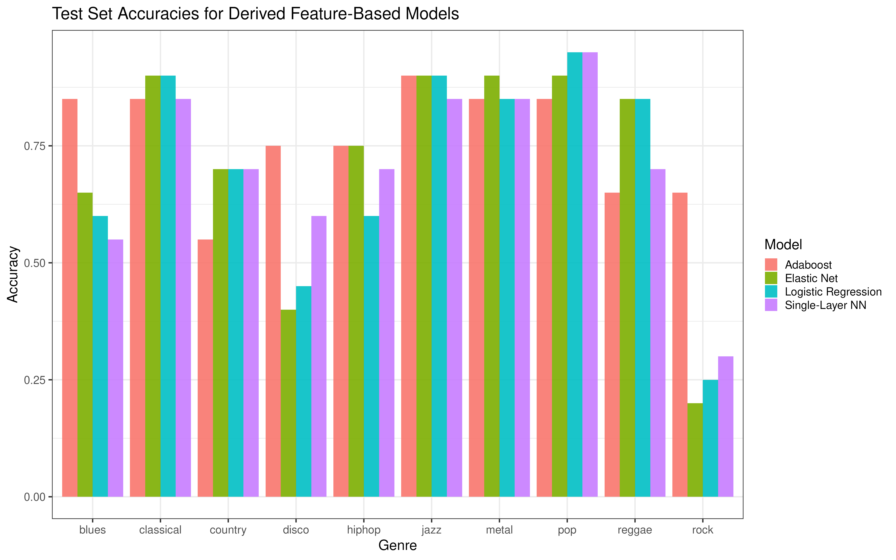

```{r setup, include=FALSE}
knitr::opts_chunk$set(echo = TRUE)
```

```{r, echo=FALSE}
suppressPackageStartupMessages(library(ggplot2))
suppressPackageStartupMessages(library(dplyr))
```


## Introduction

In this project, I explored the [GTZAN Dataset for Music Genre Classication](https://www.kaggle.com/datasets/andradaolteanu/gtzan-dataset-music-genre-classification). The dataset consists of 30-second audio files from songs across 10 different genres (100 song snippets per genre), and is primarily targeted at genre prediction from these songs. Also included are .csv files with derived features of the *Mel Spectrograms* obtained from the original audio files, both from the full 30-second clips and 3-second segments of the songs. There has already been a great deal of effort placed in to utilizing sophisticated classifiers for this dataset, but perhaps less so in trying to understanding the relationships in the dataset and performing post-hoc characterizations of those classifiers. In other words, what should we make note of before fitting a classifier, and what can we learn from after we do so?

## Exploratory Data Analysis
First, I performed some simple analyses to get a sense for the patterns and potential issues in the dataset.

```{r}
data <- read.csv('data/features_30_sec.csv')
table(data$label)
#head(data)
```

For starters, the 10 different genres are listed in the output above, and they have equal frequencies by design. There are a total of $57$ features derived from the Mel spectrograms of the original audio files. Some of these -- e.g. tempo and harmony -- are quite familiar to us, and we can speculate how that relates to genre. The rest of the variables are quite unfamiliar, at least they were to me when I first saw them. To get a better sense of what the features mean, we have to understand what the Mel spectrogram actual does, and why it's useful here.

### Mel Spectrograms

A *spectrogram* represents a time-varying waveform in the as an evolving frequency spectrum over time. This is most often computed using a Short-Time Fourier transform (STFT) -- i.e. by taking the Fourier transform for sliding windows along the waveform. At a practical level, for our song data, the spectrogram allows us to see how different key aspects of the song -- e.g. melodies, harmonies, and rhythm -- play out throughout its run-time. The key distinguishing feature of the *Mel spectrogram* is it involves a nonlinear transformation of the STFT spectrogram to the Mel scale, which happens to align more closely to the scale in which humans perceive sound. This implies that is should be more useful for genre classification compared with the STFT, though I do not explore that too much here. Two examples of the Mel spectrogram for different genres (country and classical) are shown in Figure 1, where you can observe distinct patterns.

```{r, echo = FALSE, fig.show = "hold", fig.cap = "Mel Spectrograms for two samples", out.width = '50%'}
knitr::include_graphics("figures/spect_country.png")
knitr::include_graphics("figures/spect_classical.png")
```

With this in mind, I want to clarify the most common type of feature in our dataset, which come from the so-called *Mel-frequency Cepstral coefficients (MFCCs)*. MFCCs are used computed at each sliding window of the waveform (for 20 frequency bins), and then the average and variance is computed over all windows. The precise formula for these is a bit elusive (see below), but they can be thought of as quantifying the overall quality/timbre of the sound, unrelated to the pitch or loudness.

$$
MFCC_i = \sum_{i=1}^{N_f} S_n \cos\left(i(n-0.5)\frac{\pi}{N_f} \right), i = 1,\ldots,L
$$
Two other important classes of features are *chromas*, which characterize the pitch profiles and are unchanged by timbre -- and the the percept, which relates to loudness and contrast.


### Relationships between Features & Genre
```{r,fig.show = "hold", echo = FALSE, fig.cap = "Feature heatmap (left) and Feature-Genre Associations using ANOVA (left)", out.width = '50%'}




```

I first explored how the features in the dataset correlate with each other using a heatmap (Figure 2). We observe several instances of strong correlations ($|\rho|$>0.8), most frequently among the MFCC measures. The clear structure here indicates that we may want to be careful when fitting classifiers to avoid multi-collinearity.

Next, I looked at how each of the features relates to genre. To do so, I performed separate ANOVA tests for each feature and adjusted for multiplicity in the resulting p-values using a Benjamini-Hochberg correction. The results are shown in Figure 2. Here, I found that, without controlling for other features, the chroma mean feature had the strongest evidence of association with genre, followed by the mean of the first MFCC. On the opposite end, the harmony measure and tempo had the weakest evidence of association with genre. Note that all features except `harmony_mean` had adjusted p-values less than $0.05$, suggesting the Mel spectrogram features can serve as relevant predictors of genre.

### Characterizing Genre Differences

```{r, fig.show = "hold", echo = FALSE, fig.cap = "Genre Denodrogram with hierarchical clustering (left) and plot of first two principal components with outliers", out.width = '50%'}


```

As a final step, I considered different ways to explore how distinct each genre was from the rest, in terms of the derived features. One way to do so involves looking at the genre-specific centroids of the scaled features and performing hierarchical clustering. I used `hclust` using the Ward's method to produce a dendrogram (Figure 3), characterizing the structure between genre based on the means. Doing so, I see some trends that I would expect -- e.g. that blues and country are closely related -- but also some trends I did not expect -- e.g. classical and jazz are related. The results are interesting to ponder over, but they are limited by the fact that the clustering is only based on one aspect of the data. To get a slightly more granular view, I performed PCA. From the PC plot in Figure 3, we can verify many of the same results as the dendrogram, like the similarity between metal and jazz or the dissimilarity between pop and classical. But we can also see with finer detail that rock, for instance, seems to be among the least distinct genre. Furthermore, I identified some outliers using Z-scores (using threshold $3$*SD for outlier detection), and found 3 such cases that were global outliers, and 9 songs were outliers for their genre. Among the 3 global outliers were none other than Destiny's Child (pop) and James Carter (jazz). I checked the third global outlier, though, ``Splash Out Dub`` by King Tubby (reaggae), and found that a decent portion of this file seems obscurred. As far as genre-specific outliers, one example (that is not a global outlier) is Barbra Streisand's ``No More Tears`` (coded as disco, but not sure this is accurate). This is all to say, this dataset is, of course, not perfect.

```{r}
pca_data <- read.csv('derivatives/pca_data.csv')
pca_data %>% filter(global_outlier==T | genre_outlier == T) %>% dplyr::select(filename, Genre, global_outlier, genre_outlier, filename)
```

## Classification
The rest of my analysis for this project dealt with training and evaluating classifiers for genre based derived features data. In particular, I considered four different classifiers: logistic (multinomial) regression, penalized regression via elastic net, a single-layer neural network, and Adaboost. To train the models, I utilized 10-fold cross-validation on a randomly subsetted $80\%$ training set to tune model hyperparameters, and evaluated performance on the remaining $20\%$ of samples.

The training results are shown in Figure 4. Here, we observe that the training performance under cross-validation peaks at at $74.4\%$ accuracy under the Adaboost model, not terrible considering the limited sample size and number of classes. For this adaboost model, we see that using a higher number of trees may be beneficial (though computational costly), and that tree depth should be balanced roughly somewhere close to $10$. For the multinomial logistic regression and single-layer neural networks, we see both of these models do better under higher weight decays. Given that weight decay is akin to a penalty term, this trend makes sense in light of the correlations in the features we saw earlier. Lastly, for Elastic Net, the training results indicate that ridge regression is preferred over Lasso here, and that under the former, there is little difference among the regularization terms $<0.05$. The preference for ridge regression over LASSO in Elastic Net suggests that feature selection was less important in this context, as most features contributed useful information, as we saw with the ANOVA results above.

```{r, echo = FALSE, fig.cap = "Training performance under different hyperparameters", out.width = '100%'}

```

After tuning hyperparameters, I looked at how these models performed on the test set. I evaluated the out-of-sample accuracies for each genre, and found a similar result, that Adaboost performed the best on average of the examined classifiers, with an overall test accuracy of $76.5\%$. By comparison, the elastic net model (ridge regression) had a test accuracy of $71.5\%$, while logistic regression and the NN yielded $70.5\%$ accuracies. While Adaboost performed better overall, it came at the cost of substantially higher run-time. In fact, for this reason, I pre-saved the trained models in order to generate this report. 

In Figure 5, I show how these test accuracies vary across genre. We can see that Adaboost's improved accuracy comes in large part from being able to excel in places where all other models perform poorly (e.g. blues and rock prediction). Also, we see that for rock specifically, the relatively poor performance of the other models aligns with the exploratory PC plot above, where rock visually seemed hard to pick apart from the crowd. This discrepancies point to the fact that the decision boundaries between genres is nonlinear, which Adaboost is more capable of picking up on than the competitors. I did expect classical to be relatively easy to predict, but did not expect pop, which I thought of as an amalgamation of other genres, to see such good prediction. However, both of these genres again line up with the visual PC results.


```{r, echo = FALSE, fig.cap = "Training performance under different hyperparameters", out.width = '100%'}

```

### Limitations
While the derived features are powerful, they may not capture temporal dynamics inherent in music, which could improve classification further. I did explore using CNNs on the Mel spectrograms themselves (temporally-varying), but ultimately did not see good performance with only $1000$ samples. I recognize that the devevelopers behind this dataset introduced the 3-second song snippets to address this by aiding data-hungry machine learning approaches (increasing sample size to $10000$). However, this presents its own issues, since there are multiple snippet per song, meaning the samples are not independent. To this end, my analysis avoids some of that bias and potentially inflated validation performance by focusing solely on the 30-second clips.

Another limitation is that the dataset here consists of a hand-selected sample of songs, and it is not well-documented how the genres were determined. Most songs, after all, do not necessarily belong to one genre or another. So the whole purpose of genre classification, to me, seems a bit contrived. That being said, I recognize there is a great deal of utility of audio classification that reaches far beyond this category (e.g. medical risk characterization from heartbeat signals).

## Takeaways
In this project, I learned about techniques for audio processing and applied some useful exploratory analysis and classification tools. In particular, I learned about the Mel spectrogram and the cases we may wish to use them, and how to interpret some of their key properties/components. As far as genre classification, this project reinforced the idea that there is a great deal of heterogeneity in songs, in the sense that they can be genre-blending. My results indicate that rock was the most genre-blending of these 10 genres and pop the least in this dataset (if we consider how well the chosen classifiers do). Additionally, the findings highlighted the importance of nonlinear decision boundaries for accurately classifying challenging genres, with boosting methods like Adaboost outperforming simpler models. This work also emphasized the value of regularization in handling high-dimensional audio feature spaces and the potential for feature selection to offer deeper insights into classification challenges.

